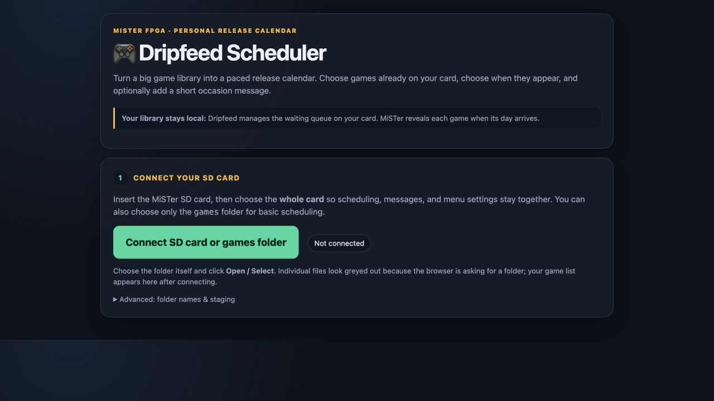
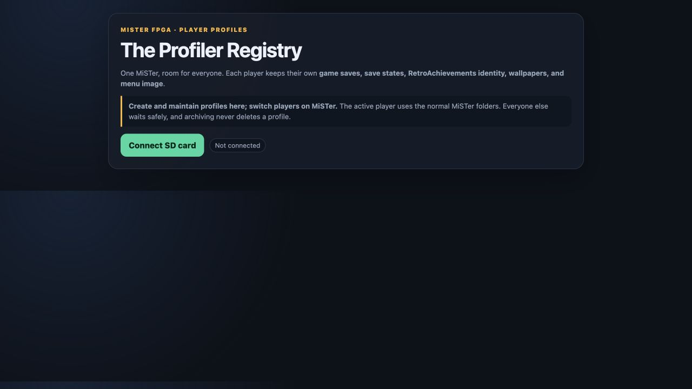
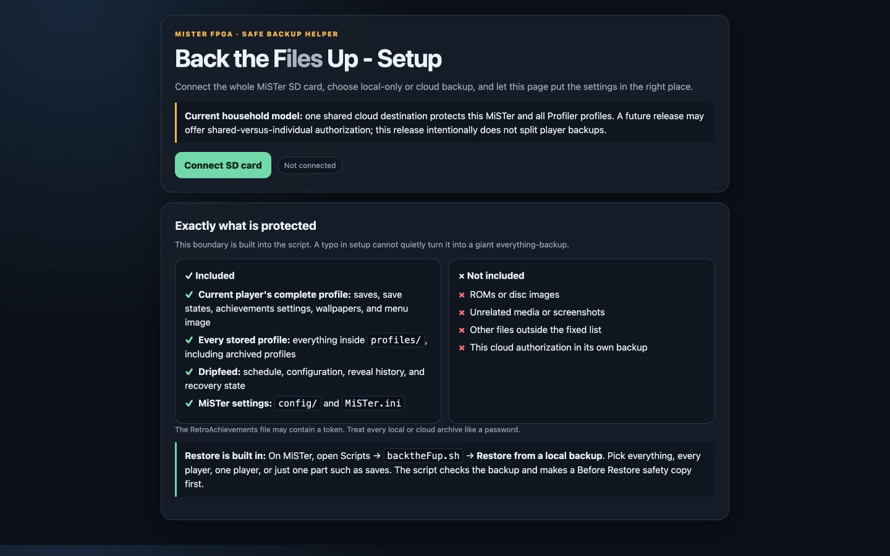
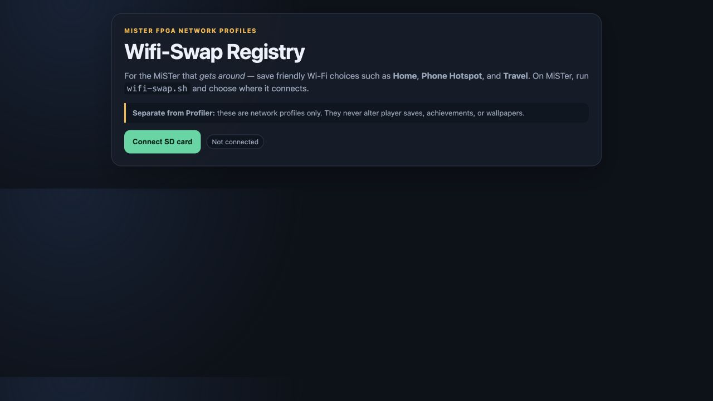

# Dripfeed

**Dripfeed** is a small MiSTer FPGA quality-of-life suite. Install only the
tools you want:

- **Dripfeed + GOT'eM** — pace game releases and create monthly spotlights.
- **Profiler** — give each player separate progress, achievements, and menu art.
- **Back the Files Up** — protect and restore hard-to-replace personal data.
- **Wifi-Swap** — switch among saved home, hotspot, and travel networks.

The suite is GPLv3-or-later, readable, editable, and vibed by **MikeyVids**. It
contains no ROMs, BIOS files, saves, credentials, or personal schedules.

## How the suite works

- **The web app runs on a computer.** Open its HTML file in Chrome, Edge, or
  Brave and connect the mounted MiSTer SD card.
- **The script runs on MiSTer.** Put the card back in MiSTer and use its Scripts
  menu. Dripfeed can also check its schedule at boot.

The browser does **not** connect to a running MiSTer. It only prepares the SD
card while the card is mounted on the computer. Safari and Firefox cannot
currently grant the folder access these offline web apps need.

---

## Dripfeed + GOT'eM

**Purpose:** Dripfeed hides only the games you schedule, then reveals them on
their dates. GOT'eM points to games already on the card and creates a separate
monthly spotlight without moving the originals.

**Use it for:** pacing a child's library, themed months, birthday releases,
backlog rotation, or personal and community Game of the Month picks.



### Web app and MiSTer scripts

- **[Dripfeed Scheduler](Dripfeed/Dripfeed-Scheduler.html):** on a computer,
  connect the whole mounted card, choose games and dates, adjust the unreleased queue,
  import/export CSV, export a calendar, and choose GOT'eM picks.
- **[Dripfeed.sh](Dripfeed/Scripts/Dripfeed.sh):** on MiSTer, installs and runs
  the engine. It waits for a trustworthy clock, reveals games that are due,
  repairs interrupted work, and updates What's New and GOT'eM.
- **[Undrip.sh](Dripfeed/Scripts/Undrip.sh):** an optional confirmed reset that
  returns waiting games to their normal folders and removes generated state.

### Features

- Schedule one file, several files, or a complete multi-disc folder.
- Keep unreleased games in a hidden card-root library outside `games/`, where
  ordinary graphical library scans cannot discover them early. The first
  update migrates old per-system queues with interruption-safe card renames.
- Let the web app prepare a schedule while the card-side engine performs the
  actual whole-folder move; no browser recursive copy/delete is used.
- Change future dates without disturbing games already revealed.
- Keep dated Dripfeed releases and monthly GOT'eM spotlights independent.
- Feature an existing Arcade game through GOT'eM without moving its original.
- Add messages, import/export CSV, export an `.ics` calendar, and recover
  cleanly from an interrupted reveal.

### Compatible cores and files

- **Consoles/handhelds:** NES, SNES, Mega Drive/Genesis, Game Boy/GBC/GBA, Game
  Gear, Master System, 32X, N64, Neo Geo, Saturn, Mega CD/Sega CD, PlayStation,
  PC Engine/TurboGrafx-16 and CD, Jaguar, and Neo Geo Pocket.
- **Computers:** Amiga/Minimig, C64, ao486/PC, and ZX Spectrum.
- **Disc sets:** `.m3u`, `.cue`, `.chd`, and `.iso`. Keep a BIN/CUE set
  together in one scheduled folder.
- **Computer media:** C64 `.d64/.g64/.t64/.d81`, ao486
  `.vhd/.img/.ima/.vfd`, and Spectrum `.z80/.sna`.
- Other system folders can still be revealed; only their What's New shortcut is
  skipped when no core mapping is known.

### Excluded and why

- Dated Dripfeed does not move Arcade files because Arcade update tools manage
  them. GOT'eM may spotlight an existing `.mra` safely.
- BIOS, firmware, Mega CD region firmware folders, Jaguar support files,
  palettes, borders, media, and core folders stay where their cores need them.
- Dripfeed never downloads or patches games. It schedules files already on your
  card.

### Limitations

- Automatic releases pause when MiSTer has no believable date and time.
- The web app sees only the card or folder you choose.
- Custom core names may need a mapping update for What's New shortcuts.
- A community GOT'eM source needs internet; local picks do not.
- Recovery protects the move, not a physically failing SD card. Keep backups.

[Full Dripfeed instructions](Dripfeed/README.md)

---

## Profiler

**Purpose:** give each player one whole-library identity while stock cores keep
using their normal save locations.

**Use it for:** separate family progress, adult/guest profiles, different
RetroAchievements accounts, or different HDMI menu art.



### Web app and MiSTer script

- **[Profiler Registry](Profiler/Profiler-Manager.html):** on a computer, connect
  the mounted card to create, rename, or archive players and add optional
  achievements credentials or wallpaper.
- **[Profiler.sh](Profiler/Profiler.sh):** on MiSTer, installs the profile system
  and switches the active player. The web app is not needed for everyday
  switching.

### Features

- Separate saves, save states, achievements login, and menu art.
- Show the active player's name in MiSTer's generated Profiler folder.
- Switch reliably through real commands under Scripts → `Profiler - <Active>`;
  the top-level Profiler folder is an indicator, not a pretend command.
- Check each switch first, use same-card renames, and roll back a failed step.
- Archive removed players instead of deleting them.

### Compatible cores and files

Profiler works across the library by swapping MiSTer's standard `saves/`,
`savestates/`, `retroachievements.cfg`, `wallpapers/`, and
`menu.png/menu.jpg`. Inactive players wait in `profiles/<Name>/`; the active
player's files remain where stock cores expect them.

### Excluded and why

ROMs, BIOS files, cores, and unrelated media are not part of a player identity.
Profiler is whole-library, not a separate profile for every game or core.

### Limitations

- One player is active at a time; Profiler does not merge saves or sync consoles.
- Return to MiSTer's menu before switching so no game is writing a save.
- The web app edits the mounted card; it does not switch a running MiSTer.
- Achievements credentials are plain text in MiSTer's normal file.
- Menu wallpaper may not appear on a 15 kHz CRT path.

[Full Profiler instructions](Profiler/README.md)

---

## Back the Files Up

**Purpose:** make small, checked archives of personal MiSTer data and optionally
send them to one shared cloud destination.

**Use it for:** backing up after a long session, before `update_all`, before an
SD-card change, or before experimenting.



### Web app and MiSTer script

- **[Back the Files Up - Setup](Backup/Back-the-Files-Up-Setup.html):** on a
  computer, connect the mounted card once to choose local/cloud mode, retention,
  destination, rclone authorization, and the ARMv7 rclone helper. Its **Check my
  setup** button identifies one next action and repairs missing launchers or
  engines. **This page prepares the card; it does not run a backup or restore.**
- **[backtheFup.sh](Backup/Scripts/backtheFup.sh):** on MiSTer, runs backup,
  local restore, cloud check, or a read-only list of protected data.

After setup, backups and local restores run from MiSTer's Scripts menu without a
computer. Cloud upload uses MiSTer's Wi-Fi or Ethernet. For a cloud restore,
download the archive and matching checksum into `_Backups/`, then restore it
from MiSTer.

### Features

- Create separate Live MiSTer and Profiler archives.
- Verify each ZIP or `.tar.gz`, then add a checksum and readable manifest.
- Keep rolling local copies and optionally upload through rclone.
- Restore everything, all players, one player, or one type of data.
- Verify and stage a restore, make a Before Restore backup, and roll back an
  interrupted replacement.

### Compatible files

- **Live:** `saves/`, `savestates/`, `retroachievements.cfg`,
  small settings from `config/`, `MiSTer.ini`, and Dripfeed engine state. Queued
  game payloads remain part of the ROM library, not the backup.
- **Profiler:** every stored profile plus the active player's live saves, save
  states, achievements file, wallpapers, and menu image.

These are standard locations, so save backup works across MiSTer cores without
a separate core list.

### Excluded and why

- ROMs, disc images, Arcade content, and unrelated media are excluded to keep
  archives small and focused on irreplaceable personal data.
- Rebuildable databases, caches, thumbnails, and logs under `config/` are
  excluded; each run prints a source-size preflight before compression.
- It is not a bootable SD-card image.
- Cloud authorization is not copied into the backup archive.

### Limitations

- Cloud needs internet, correct time, Linux ARMv7 rclone, and one-time
  authorization prepared on a computer.
- You normally authorize once; rclone reuses its token until access is revoked
  or expires.
- Guided restore reads local archives, so copy a cloud archive back first.
- Archives are not encrypted and may contain achievements credentials.
- Local retention does not delete old cloud copies.
- A weekly boot rule runs only if MiSTer boots on that day.

[Full backup and restore instructions](Backup/README.md)

---

## Wifi-Swap

**Purpose:** save friendly network choices on the card and switch among them
from MiSTer's Scripts menu.

**Use it for:** home, another home, a phone hotspot, or travel Wi-Fi without
typing long passwords with a controller.



### Web app and MiSTer script

- **[Wifi-Swap Registry](Wifi-Swap/Wifi-Swap-Registry.html):** on a computer,
  connect the mounted card to add, edit, or remove named networks.
- **[wifi-swap.sh](Wifi-Swap/Scripts/wifi-swap.sh):** on MiSTer, choose a saved
  network. It uses a compatible official Wi‑Fi helper and can cache the current
  helper without overwriting an older installed script.

Wifi profiles are separate from Profiler player profiles. Wi-Fi settings live
in MiSTer's standard `linux/wpa_supplicant.conf`, not `MiSTer.ini`.

### Features

- Save Home, Hotspot, Travel, or other friendly labels.
- Import compatible networks already remembered by MiSTer without exposing
  their passwords in the Registry screen.
- Support WPA/WPA2 Personal, open networks, and hidden SSIDs.
- Store the correct country with each network.
- Preserve networks created outside Wifi-Swap.
- Select the chosen Registry profile by an exact internal ID, even when several
  radio access points advertise the same network name.
- Restore the previous configuration after a failed connection.

### Compatible hardware and settings

One compatible MiSTer USB Wi-Fi adapter, current official `wifi.sh` with
library-mode support, WPA/WPA2 Personal passwords or 64-digit WPA keys, open
networks, hidden SSIDs, and MiSTer's standard Wi-Fi configuration.

### Excluded and why

Wifi-Swap does not manage saves or player profiles and does not replace the
official Wi-Fi helper. It only gives that helper a friendly list of choices.

### Limitations

- The DE10-Nano has no built-in Wi-Fi; a compatible USB adapter is required.
- WPA-Enterprise, captive portals, WEP, and SAE-only WPA3 are unsupported.
- Changing networks interrupts SSH and network shares using the old connection.
- A hotspot must still be awake, in range, and able to give MiSTer an address.
- Generated WPA keys are credentials; protect the card and backups.

[Full Wifi-Swap instructions](Wifi-Swap/README.md)

---

## Safety and validation

### Dripfeed + GOT'eM

Never overwrites a visible game, keeps firmware out of the schedule, moves a
multi-disc folder as one item, and journals interrupted work. Tests cover
scheduling, rescheduling, reveals, recovery, GOT'eM, CSV, firmware guards, and
disc folders.

### Profiler

Checks a switch before moving data, rolls back failed steps, and archives instead
of deleting. Tests cover create, switch, archive, active-player receipts, invalid
names, and rollback paths.

### Back the Files Up

Keeps the archive boundary fixed, verifies archives and restore paths, stages
changes, and makes a safety backup before restore. Tests cover ZIP/tar,
retention, manifests, cloud handoff, selective restore, and rollback.

### Wifi-Swap

Preserves networks it does not own, validates before and after changes, and
restores the prior setup after failure. Tests cover profile changes, country,
last-connected state, atomic replacement, and rollback.

Hardware-only checks—real controllers, adapters, network time, browser folder
permission, MiSTer menus, and a real cloud account—are in
[`GOLDEN_PATH.md`](GOLDEN_PATH.md).

```sh
bash tests/run.sh
```

## Install details, license, and credits

- [Hardware checklist](GOLDEN_PATH.md)
- [Contributing](CONTRIBUTING.md)
- [Credits](CREDITS.md)
- [GPLv3-or-later license](LICENSE)
